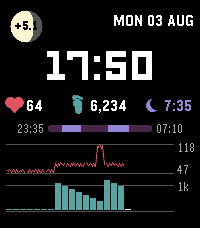

# AstroLife

Pebble Time 2 watchface with astronomy (moon phase, sunrise/sunset) and health
stats (pulse, steps, sleep).

Written in C for the emery platform (200×228, 64 colors).



## What it shows

- **Sun** — sunrise time above, sunset time below, computed on the watch
  (NOAA-style, all integer math). The location is compiled in — edit
  `SUN_LAT100` / `SUN_LON100` in `src/c/astrolife.c` for your city.
- **Moon** — rendered per-scanline from the actual lunar cycle, with a signed
  countdown beneath it: `-3.4` = days until the nearest new/full moon,
  `+3.4` = days past it (the moon's shape tells you which one).
- **24-hour time** and date.
- **Totals line** — current heart rate (♥), steps today (footprint), and last
  night's sleep total (crescent).
- **Sleep stripe** — last night from bedtime to wake time; light sleep in dim
  purple, deep sleep as bright lavender blocks.
- **Heart-rate chart** — today at 10-minute resolution, scaled to the day's
  min–max range (labeled on the right); gaps where the HRM had no readings.
- **Step chart** — 24 hourly bars with a gray 1k reference line; the current
  hour is highlighted.

All data comes from the on-watch HealthService — no phone app or JS companion
needed.

## Building & running

Requires the [Pebble SDK](https://developer.repebble.com/sdk/).

```sh
pebble build                          # produces the .pbw bundle in build/
pebble install --emulator emery       # run in the Pebble Time 2 emulator
pebble install --cloudpebble          # install to your watch via Dev Connect
```

To preview charts with synthetic data in the emulator (it has no health
sensors), flip the `#ifdef DEMO_DATA` guards in `src/c/astrolife.c` to
`#if 1` and rebuild.
